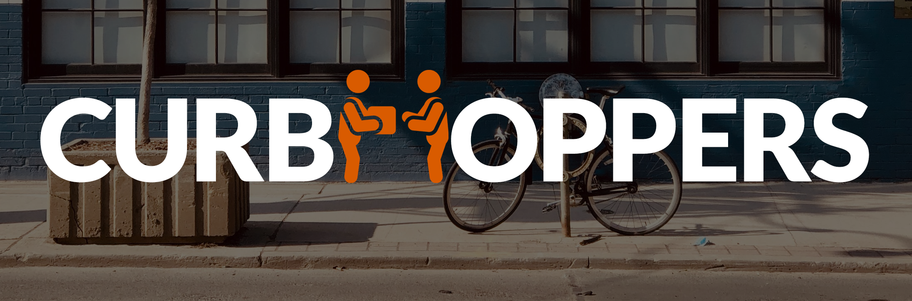

> Curb Hoppers provides an end to end shopping experience that allows small businesses to implement curb side pickup. This is a group project that was complete for DevCodeCamp. Curb Hoppers utilizes the following technologies: ASP.NET Core MVC, JavaScript, JQuery, Node.js, Express.js, SASS, and HTML/CSS.
>

# Team Members
* Mike Treml  <a href="https://linkedin.com/in/miketreml" rel="nofollow" alt="LinkedIn" >LinkedIn</a>
* Janelle Johnson  <a href="https://linkedin.com/in/janellepennistonjohnson" rel="nofollow" alt="LinkedIn" >LinkedIn</a>
* Pascal Pascarella  <a href="https://linkedin.com/in/pascal-pascarella-72933b48" rel="nofollow" alt="LinkedIn" >LinkedIn</a>
